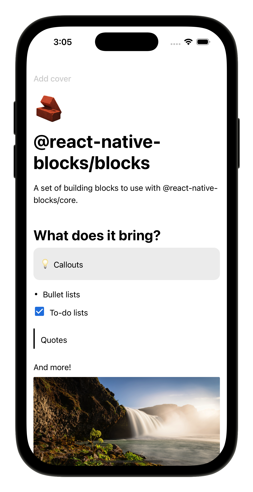

# @react-native-blocks/blocks

A set of block components to use in conjunction [@react-native-blocks/core](https://www.npmjs.com/package/@react-native-blocks/core) library. Provides the necessary blocks to build a Notion-like text editor.

<div style="width: 100%; display: flex; justify-content: center; align-items: center;">
    
</div>

## Installation

> [!NOTE]
> Remember this library it's meant to be used with `@react-native-blocks/core`.

```
npm install @react-native-blocks/blocks
```

Now you can start using all the available blocks with `@react-native-blocks/core`.

## Available block types

By the moment the following are the available block types.

- Text
- Header 1
- Header 2
- Header 3
- To-do list
- Bulleted list
- Numbered list
- Callout
- Quote
- Image

I'll be working on adding more block types, but if you want you can contribute to this repo by creating some of the following blocks:

- Numbered lists
- Toggle lists
- Tables

If you have any ideas for new blocks or feedback you may want to give on the already existing ones you can chat with me in [Discord](https://discord.gg/utxtAafD8n).

## Warning
This library is still a work in progress so expect breaking changes on future releases.


