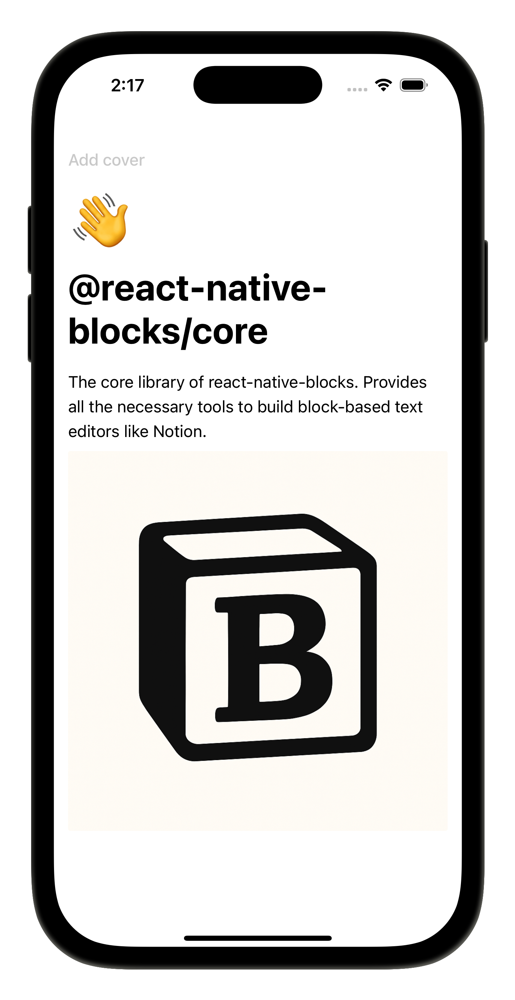

# @react-native-blocks/core

Inspired by the data model behind Notion's flexibility, `@react-native-blocks/core` is the core library of [react-native-blocks](https://github.com/PatoSala/react-native-blocks/tree/main). Provides all the tools necessary to build block-based text editors like Notion. [Try it on Expo Snack](https://snack.expo.dev/@patosala/react-native-blocks?platform=ios).

<div style="width: 100%; display: flex; justify-content: center; align-items: center;">
  
</div>

## Quick start

### 1. Install in your React Native Project.

```
npm install @react-native-blocks/core
```

### 2. Install a block-component library

`@react-native-blocks/core` by it's own only provides the necessary tools to create a block based interface but does not provide the block components to be rendered. It´s up to you if you want to use an already existing set of blocks, create your own or even use both at the same time. In this example we'll be using [@react-native-blocks/blocks](https://www.npmjs.com/package/@react-native-blocks/blocks) which provides a set of blocks similar to the ones present in Notion (Pages, Headings, Checkboxes, etc).

```
npm install @react-native-blocks/blocks
```

## Example usage with [@react-native-blocks/blocks](https://www.npmjs.com/package/@react-native-blocks/blocks)

With both libraries installed we'll use from `@react-native-blocks/core` the `<Editor/>` component to create a new editor and the `<Block/>` component to register the building blocks that `<Editor/>` will use. And from `@react-native-blocks/blocks` we'll import the blocks we want to use in our editor.

```js
import { StatusBar } from 'expo-status-bar';
import { SafeAreaProvider, SafeAreaView } from 'react-native-safe-area-context';
import {
  Editor,
  Block
} from '@react-native-blocks/core';
import {
  PageBlock,
  TextBlock,
  ImageBlock
} from '@react-native-blocks/blocks';

const initialBlocks = {
    "1": {
      id: "1",
      type: "page",
      properties: {
          title: "@react-native-blocks/core"
      },
      format: {
        page_icon: "👋"
      },
      content: ["2", "3"],
      parent: "root"
    },
    "2": {
      id: "2",
      type: "text",
      properties: {
          title: "The core library of react-native-blocks. Provides all the necessary tools to build block-based text editors like Notion."
      },
      content: [],
      parent: "1"
    },
    "3": {
      id: "3",
      type: "image",
      properties: {
          source: "https://raw.githubusercontent.com/PatoSala/react-native-blocks/8862145f6a3fb6ecc055445da92f265d02069283/assets/logo-small-white.png"
      },
      format: {
        block_aspect_ratio: 1,
        block_width: 1024
      },
      content: [],
      parent: "1"
    }
}

export default function App() {

  const extractBlocks = (blocks) => {
    console.log("blocks", blocks);
  }

  return (
    <SafeAreaProvider>
      <SafeAreaView style={{ flex: 1}} edges={["top"]}>
        <Editor          
          defaultBlocks={blankNote}
          extractBlocks={extractBlocks}
        >
          <Block
            type="text"
            component={TextBlock}
            options={{
              isTextBased: true,
              name: "Text"
            }}
          />

          <Block
            type="page"
            component={PageBlock}
            options={{
              isTextBased: true,
              name: "Page"
            }}
          />

          <Block
            type="image"
            component={ImageBlock}
            options={{
              name: "Image"
            }}
          />
        </Editor>

        <StatusBar style="auto" />
      </SafeAreaView>
    </SafeAreaProvider>
  );
}
```

## Warning
This library is still a work in progress so expect breaking changes on future releases. If you have any doubts you can join our [Discord server](https://discord.gg/utxtAafD8n).